---
## Front matter
title: "Отчет о прохождении 2 этапа внешнего курса"
subtitle: "Работа на сервере"
author: "Иванов Сергей Владимирович, НПИбд-01-23"

## Generic otions
lang: ru-RU
toc-title: "Содержание"

## Bibliography
bibliography: bib/cite.bib
csl: pandoc/csl/gost-r-7-0-5-2008-numeric.csl

## Pdf output format
toc: true # Table of contents
toc-depth: 2
lof: true # List of figures
fontsize: 12pt
linestretch: 1.5
papersize: a4
documentclass: scrreprt
## I18n polyglossia
polyglossia-lang:
  name: russian
  options:
	- spelling=modern
	- babelshorthands=true
polyglossia-otherlangs:
  name: english
## I18n babel
babel-lang: russian
babel-otherlangs: english
## Fonts
mainfont: PT Serif
romanfont: PT Serif
sansfont: PT Sans
monofont: PT Mono
mainfontoptions: Ligatures=TeX
romanfontoptions: Ligatures=TeX
sansfontoptions: Ligatures=TeX,Scale=MatchLowercase
monofontoptions: Scale=MatchLowercase,Scale=0.9
## Biblatex
biblatex: true
biblio-style: "gost-numeric"
biblatexoptions:
  - parentracker=true
  - backend=biber
  - hyperref=auto
  - language=auto
  - autolang=other*
  - citestyle=gost-numeric
## Pandoc-crossref LaTeX customization
figureTitle: "Рис."
listingTitle: "Листинг"
lofTitle: "Список иллюстраций"
lolTitle: "Листинги"
## Misc options
indent: true
header-includes:
  - \usepackage{indentfirst}
  - \usepackage{float} # keep figures where there are in the text
  - \floatplacement{figure}{H} # keep figures where there are in the text
---

# Цель работы

Ознакомиться с функционалом операционной системы Linux.

# Задание

Просмотреть видео и на основе полученной информации пройти тестовые задания.

# Теоретическое введение

Линукс - в части случаев GNU/Linux — семейство Unix-подобных операционных систем на базе ядра Linux, включающих тот или иной набор утилит и программ проекта GNU, и, возможно, другие компоненты. Как и ядро Linux, системы на его основе, как правило, создаются и распространяются в соответствии с моделью разработки свободного и открытого программного обеспечения. Linux-системы распространяются в основном бесплатно в виде различных дистрибутивов — в форме, готовой для установки и удобной для сопровождения и обновлений, — и имеющих свой набор системных и прикладных компонентов, как свободных, так и проприетарных. 

# Выполнение лабораторной работы

{#fig:001 width=70%}

Удаленный сервер - это компьютер, находящийся в дата-центре, к которому можно получить удаленный доступ через сеть Интернет. Удаленный сервер обычно используется для размещения веб-сайтов, приложений, баз данных и других сервисов, которые необходимы для функционирования сайта или бизнес-процессов компании. Пользователи могут получить доступ к удаленному серверу с помощью протоколов удаленного доступа, таких как RDP, VNC или SSH.

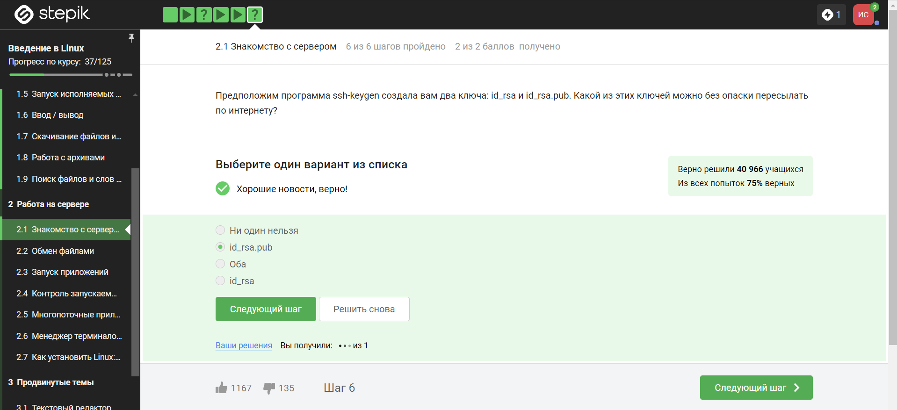{#fig:002 width=70%}

Только id_rsa.pub, так как он является открытым.

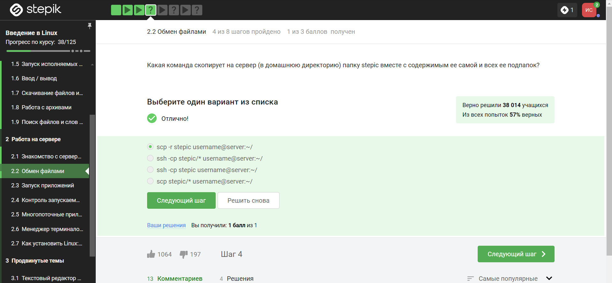{#fig:003 width=70%}

-r = Recursively copy entire directories. Note that scp follows symbolic links encountered in the tree traversal.

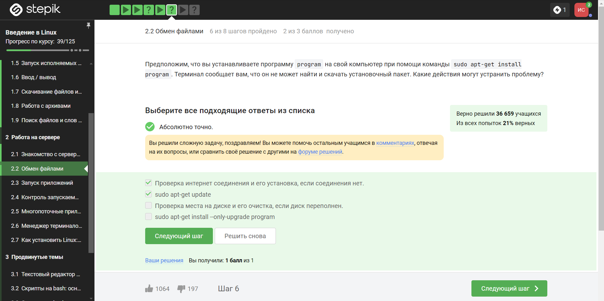{#fig:004 width=70%}

Проверяем интернет соединение на предмет того, что устройство не может соединиться с сервером, затем проверяем то, знает ли оно вообще о существовании такой программы.

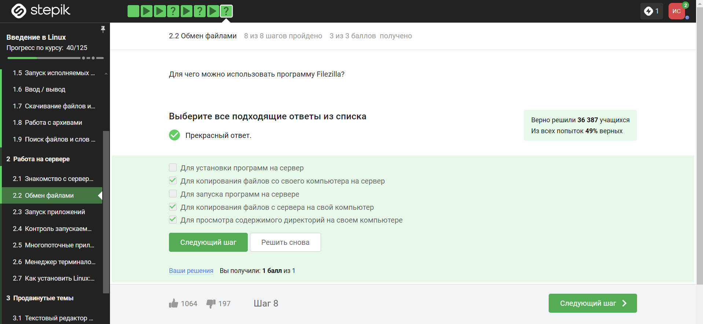{#fig:005 width=70%}

FileZilla — свободный многоязычный проект, посвящённый приложениям для FTP. Включает в себя отдельное приложение «FileZilla Client» (являющееся FTP-клиентом), и «FileZilla Server». Приложения публикуются с открытым исходным кодом для Windows, macOS и Linux. Клиент поддерживает FTP, SFTP, и FTPS (FTP через SSL/TLS) и имеет настраиваемый интерфейс с поддержкой смены тем оформления.

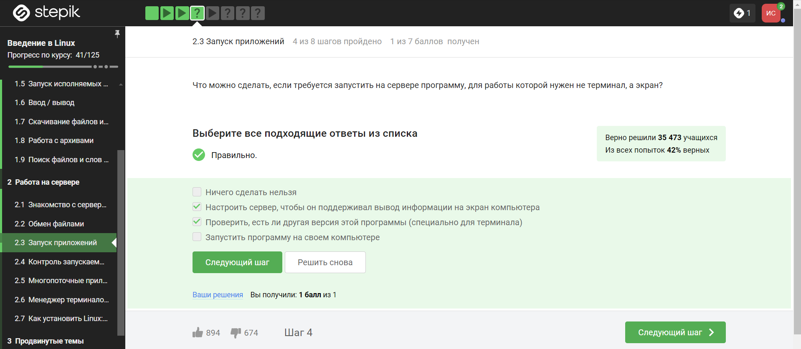{#fig:006 width=70%}

1. Проверить, есть ли другая версия этой программы (специально для терминала)

2. Настроить сервер, чтобы он поддерживал вывод информации на экран компьютера

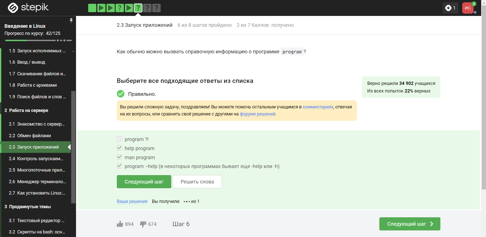{#fig:007 width=70%}

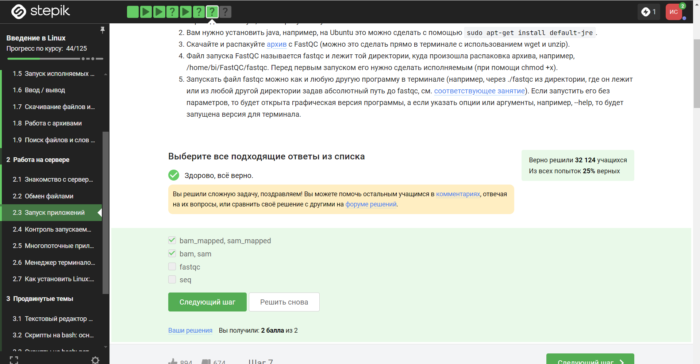{#fig:008 width=70%}

FastQC supports files in the following formats

FastQ (all quality encoding variants)
Casava FastQ files*
Colorspace FastQ
GZip compressed FastQ
SAM
BAM
SAM/BAM Mapped only (normally used for colorspace data)

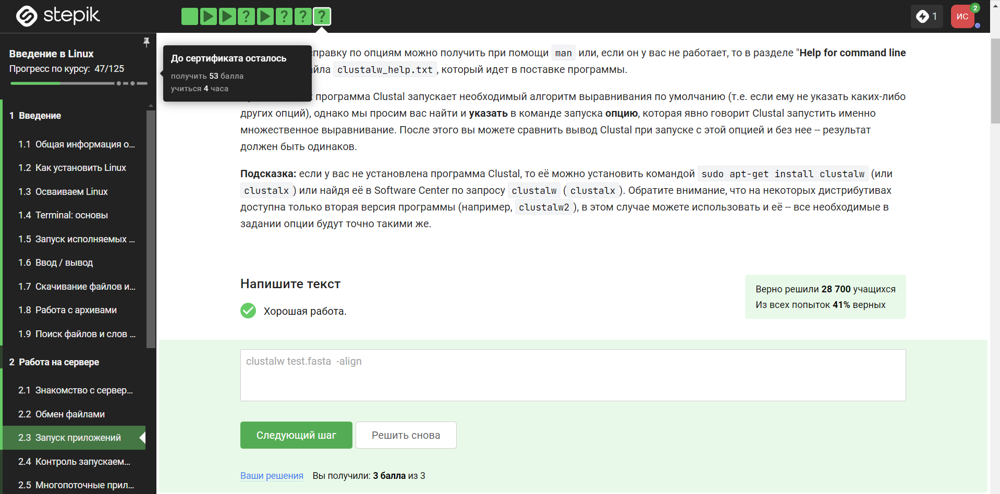{#fig:09 width=70%}

-align
Do full multiple alignment.

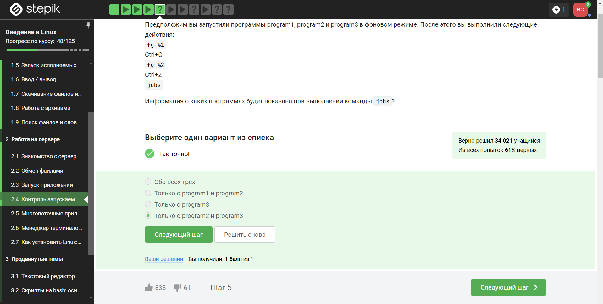{#fig:010 width=70%}

Комбинация Ctrl+С - завершает процесс.
Комбинация Ctrl+Z - приостанавливает процесс.

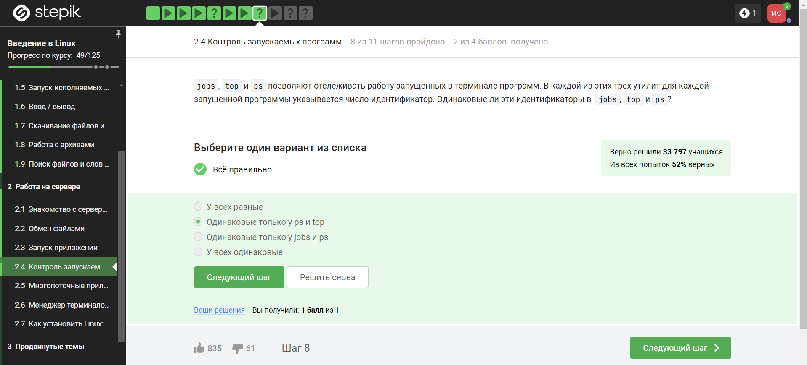{#fig:011 width=70%}

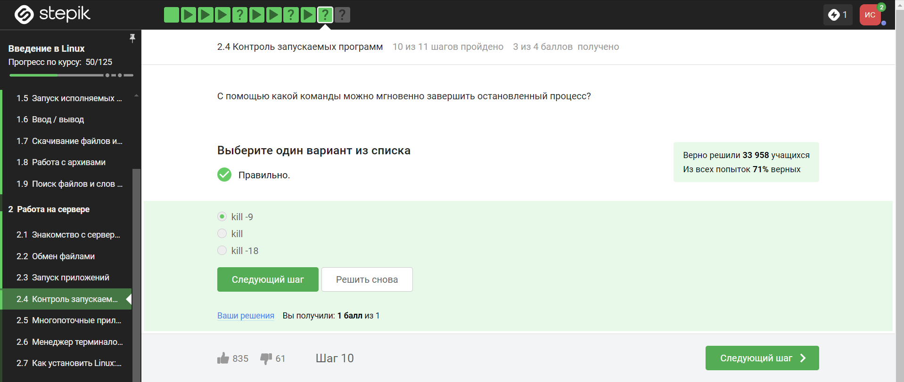{#fig:012 width=70%}

Если сигнал не перехватывается процессом, процесс уничтожается. Следовательно, это используется для изящного завершения процесса. Команда «kill -9» отправляет сигнал уничтожения для немедленного завершения любого процесса, если он присоединен к PID или имени процесса . Это принудительный способ убить/завершить набор процессов

{#fig:013 width=70%}

Команда kill шлёт сигнал о завершении процесса. Но программа обрабатывает сигналы только когда она исполняется, пока она остановлена она не может обработать сигнал и приступит к его обработке только после продолжения работы. 

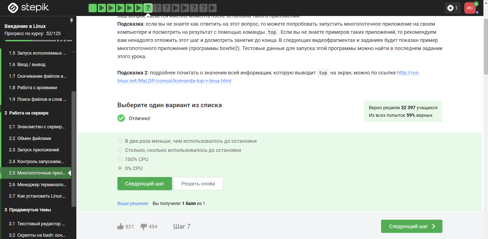{#fig:014 width=70%}

Запущенная программа потребляет ресурсы CPU, а остановленная нет.

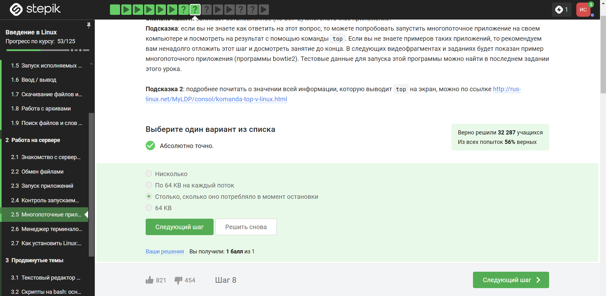{#fig:015 width=70%}

Приостановленное приложение не выполняет новых действий, поэтому не занимает вычислительные ресурсы компьютера (CPU 0%). При этом, в оперативной памяти оно сохранится, поэтому оно будет занимать столько же оперативной памяти, сколько до постановки на паузу.

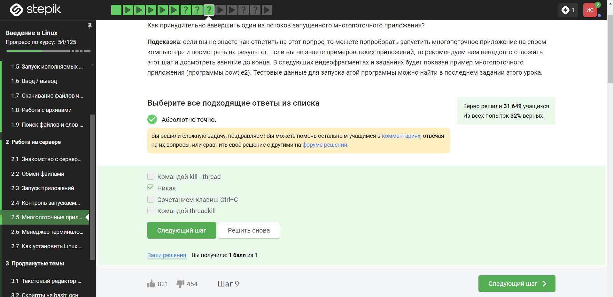{#fig:016 width=70%}

Although it is possible to specify the TID (thread ID, see gettid(2)) of one of the threads in a multithreaded process as the argument of kill, the signal is nevertheless directed to the process (i.e., the entire thread group). In other words, it is not possible to send a signal to an explicitly selected thread in a multithreaded process. The signal will be delivered to an arbitrarily selected thread in the target process that is not blocking the signal. 

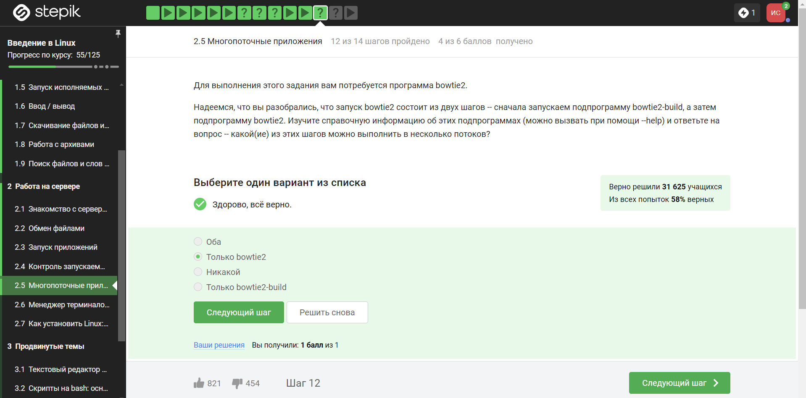{#fig:017 width=70%}

{#fig:018 width=70%}

```
echo "306174 reads; of these:
  306174 (100.00%) were unpaired; of these:
    11 (0.00%) aligned 0 times
    305580 (99.81%) aligned exactly 1 time
    583 (0.19%) aligned >1 times
100.00% overall alignment rate" > bowtie.log

```

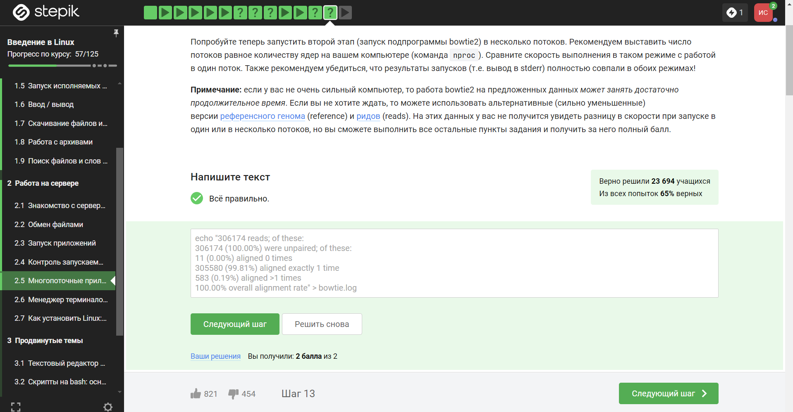{#fig:019 width=70%}

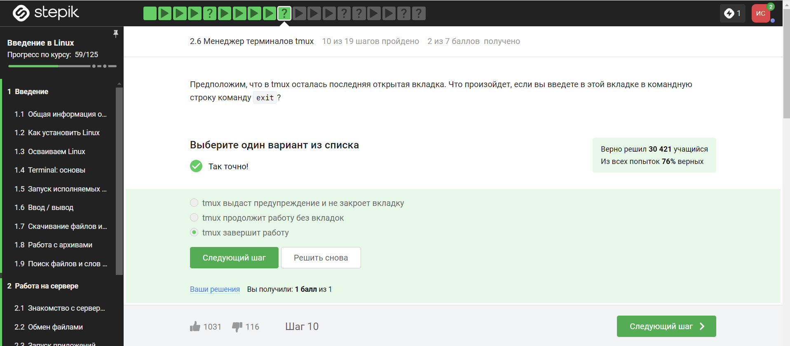{#fig:020 width=70%}

exit завершает работу tmux

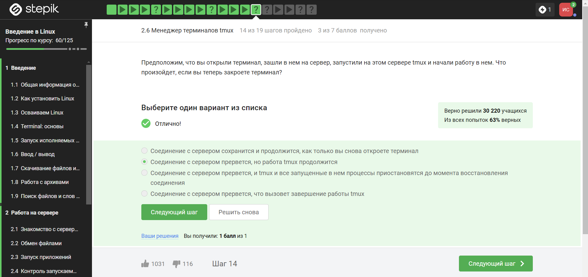{#fig:021 width=70%}

Мы заходили на сервер с терминала, который и закрыли, а tmux будет продолжать свою работу на сервере.

{#fig:022 width=70%}

Ещё будет предупреждение о том, что работа завершится. Запущенный процесс во вкладке, конечно же, при её закрытии, пропадёт.

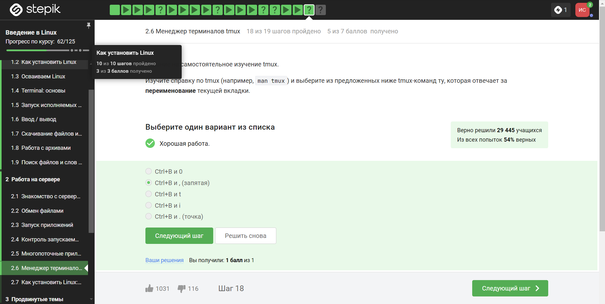{#fig:023 width=70%}

Ctrl+b c - создать новое окно;

Ctrl+b w - выбрать окно из списка;

Ctrl+b 0-9 - открыть окно по его номеру;

Ctrl+b , - переименовать текущее окно;

Ctrl+b % - разделить текущую панель по горизонтали;

Ctrl+b " - разделить текущую панель по вертикали;

Ctrl+b стрелка - перейти на панель, находящуюся в стороне, куда указывает стрелка;

Ctrl+b Ctrl+стрелка - изменить размер текущей панели;

Ctrl+b o - перейти на следующую панель;

Ctrl+b ; - переключаться между текущей и предыдущей панелью;

Ctrl+b x - закрыть текущую панель;

Ctrl+b [ - войти в режим копирования (подробнее ниже);

Ctrl+b ] - вставить из внутреннего буфера обмена tmux;

Ctrl+b d - отключится от текущей сессии;

Ctrl+b : - открыть командную строку.

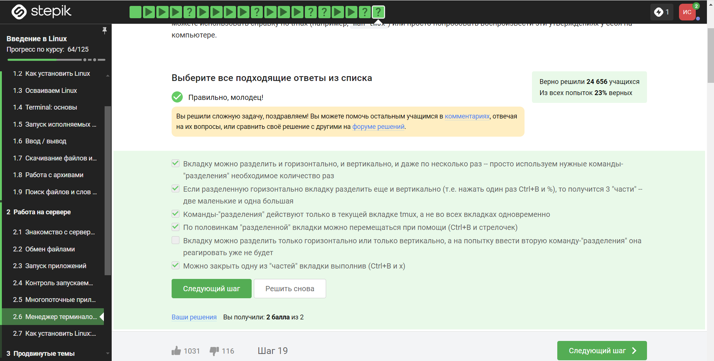{#fig:024 width=70%}

Можно закрыть одно из делений вкладки выполнив команды Ctrl+B и Х.

По половинам "разделенной" вкладки можно перемещаться при помощи Ctrl+B и стрелок - как описано в задании выше.

Делить экран можно только в текущей вкладке tmux, а не во всех вкладках одновременно.

# Вывод

Я просмотрел курс и освежил в памяти навыки работы с архивами, скачивание файлов, команды grep и тп.

# Список литературы{.unnumbered}

1. Введение в Linux

::: {#refs}
:::

